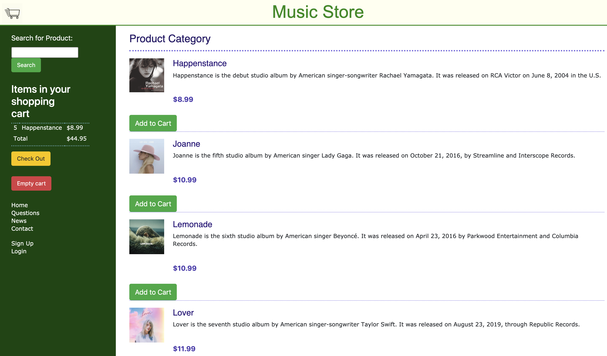
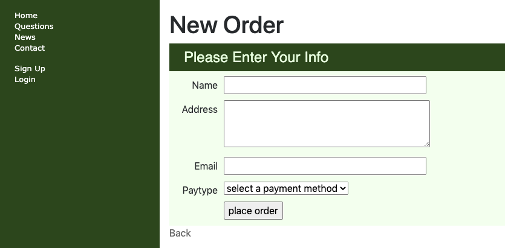
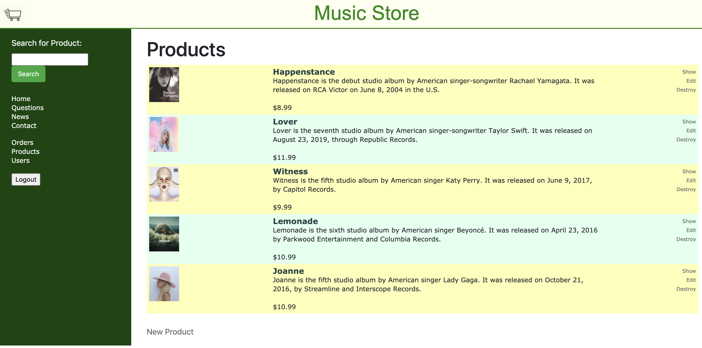
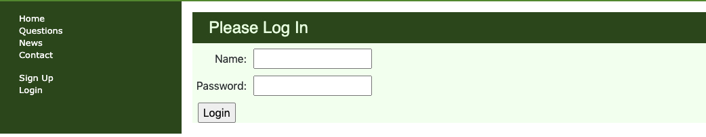

# Online Music Store Application

This is a online music store build with Ruby on Rails. There are mainly two views, one for shopper who can
search products, add to cart and check out, another for seller(admin) who can manage the products (CRUD)
as well as manage the shopper's orders.

- This is a course project for COEN 278 Advanced Web Programming 

- **Front-end**: HTML, CSS, JavaScript, AJAX 

- **Back-end**: ruby, SQLite

## Views for Shopper
- In shopper page, customer can add products into cart(AJAX) then place order. 

- The checking-out page, all the ordering data will be stored into database for seller's future management.

## Views for Seller
- The product page, sellers can manage the products by adding, editing, deleting.

- The Order page, Sellers can browse all orders that customers placed.

- The log-in page for admin. You can use user: floralan password:1234567 to log in or sign up a new account. 

